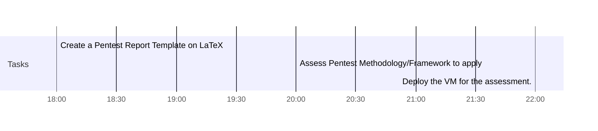

## Day Planner

```mermaid
gantt
    dateFormat  HH-mm
    axisFormat %H:%M
    %% Current Time: 5:35:41 PM
    section Tasks
    Create a Pentest Report Template on LaTeX     :18-00, 120mm
    Assess Pentest Methodology/Framework to apply     :20-00, 120mm
    Deploy the VM for the assessment.     :22-00, 0mm
    section Breaks

```

- [ ] 18:00 Create a Pentest Report Template on LaTeX
- [ ] 20:00 Assess Pentest Methodology/Framework to apply
- [ ] 22:00 Deploy the VM for the assessment.
