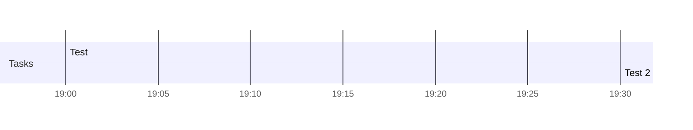

## Day Planner

```mermaid
gantt
    dateFormat  HH-mm
    axisFormat %H:%M
    %% Current Time: 7:12:57 PM
    section Tasks
    Test     :19-00, 30mm
    Test 2     :19-30, 0mm
    section Breaks

```

- [ ] 19:00 Test
- [ ] 19:30 Test 2
- [ ]  

Show the Day Planner Timeline

