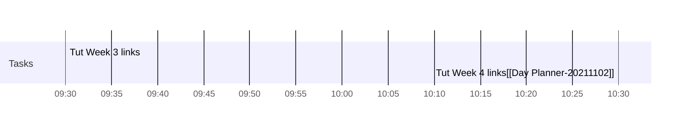

# {{title}}

## Day Planner

```mermaid
gantt
    dateFormat  HH-mm
    axisFormat %H:%M
    %% Current Time: 11:59:30 PM
    section Tasks
    Tut Week 3 links     :09-30, 60mm
    Tut Week 4 links[[Day Planner-20211102]]     :10-30, 0mm
    section Breaks

```

### Reading Materials
- [x] 09:30 Tut Week 3 links
- [x] 10:30 Tut Week 4 links[[Day Planner-20211102]]